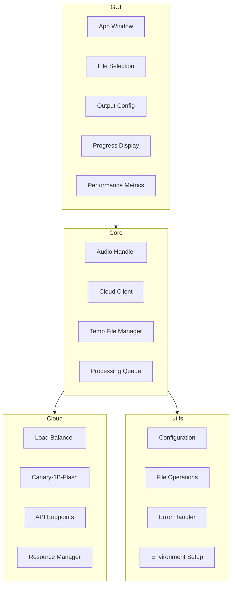

# System Patterns

## Architecture Overview
The application follows a hybrid architecture pattern with local and cloud components:

1. GUI Layer (Presentation)
   - Handles user interface and interactions
   - Manages file/directory selection
   - Handles output directory configuration
   - Displays progress and metrics
   - Real-time performance monitoring

2. Core Layer (Business Logic)
   - Audio file processing and conversion
   - Cloud API communication
   - Local file management
   - Temporary file tracking and cleanup
   - Performance metrics collection

3. Cloud Layer (Transcription Service)
   - NVIDIA Canary-1B-Flash model
   - RESTful API endpoints
   - Multi-language support
   - Translation capabilities
   - Timestamp generation

4. Utils Layer (Infrastructure)
   - Configuration management
   - File system operations
   - Error handling
   - Environment setup

## Design Patterns
1. **Observer Pattern**
   - Used for progress updates
   - GUI subscribes to transcription progress
   - Real-time metrics updates

2. **Factory Pattern**
   - Audio file handler creation
   - Supports multiple file formats
   - Cloud service configuration

3. **Strategy Pattern**
   - Different transcription strategies (cloud/local)
   - Multi-language processing
   - Configurable output handling

4. **Command Pattern**
   - Transcription job management
   - Cloud resource management
   - File cleanup operations

## Component Relationships

## Error Handling Strategy
- Graceful degradation
- Cloud service fallback mechanisms
- User-friendly error messages
- Detailed logging for debugging
- Recovery mechanisms for API failures
- Automatic cleanup on errors

## Data Flow
1. User selects file(s)/directory
2. User configures output location
3. Audio files validated and queued
4. Files processed through cloud service
5. Progress updates sent to GUI
6. Temporary files cleaned up
7. Transcriptions saved to disk
8. Performance metrics updated

## State Management
- Processing state tracking
- Cloud service status monitoring
- Output directory configuration
- Temporary file registry
- Real-time metrics collection
- Error state handling

## Resource Management
- Cloud resource optimization
- Automatic scaling on Akash
- Temporary file cleanup
- Memory usage optimization
- Disk space management
- API rate limiting
- Background thread management 